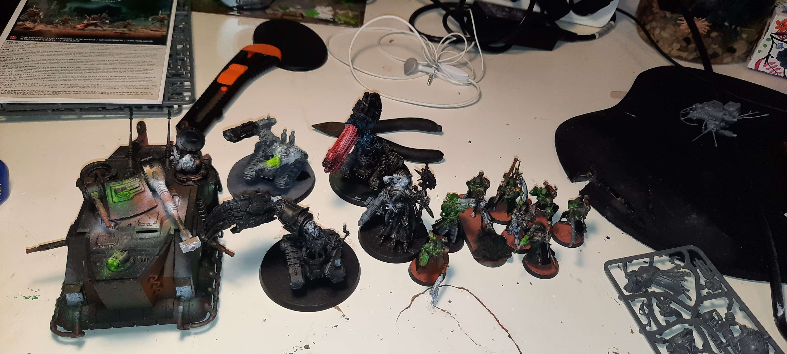
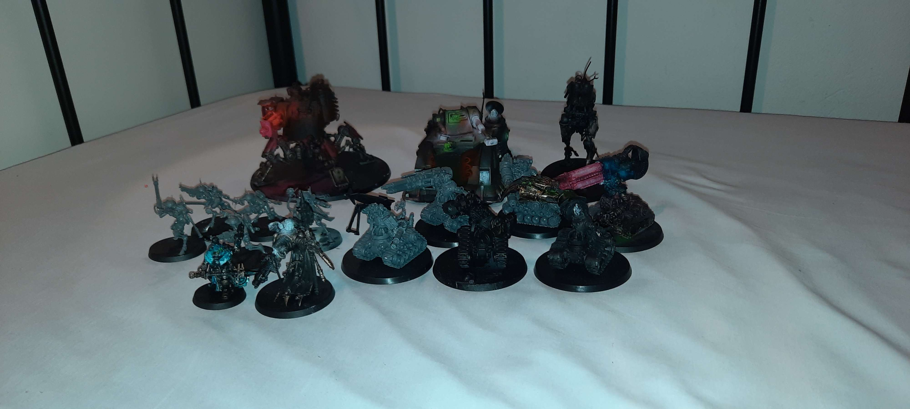

There is no truth in flesh, only betrayal. The Enemy is the Friend. The Friend was the Emperor. Only the Black Lords can rule. With these words of truth I lead my Army into battle. Cold calculations over emotions, I will rule my Army.

## Phase I: 500 Pkte

Download <a href="../assets/armylists/500/500_army.txt" download>500 Pkte army list</a> als .txt.

## Phase II: 750 Pkte

Download <a href="../assets/armylists/750/750_army.txt" download>750 Pkte army list</a> als .txt.  
Download <a href="../assets/armylists/750/750_army.rosz" download>750 Pkte army list</a> als .rosz.