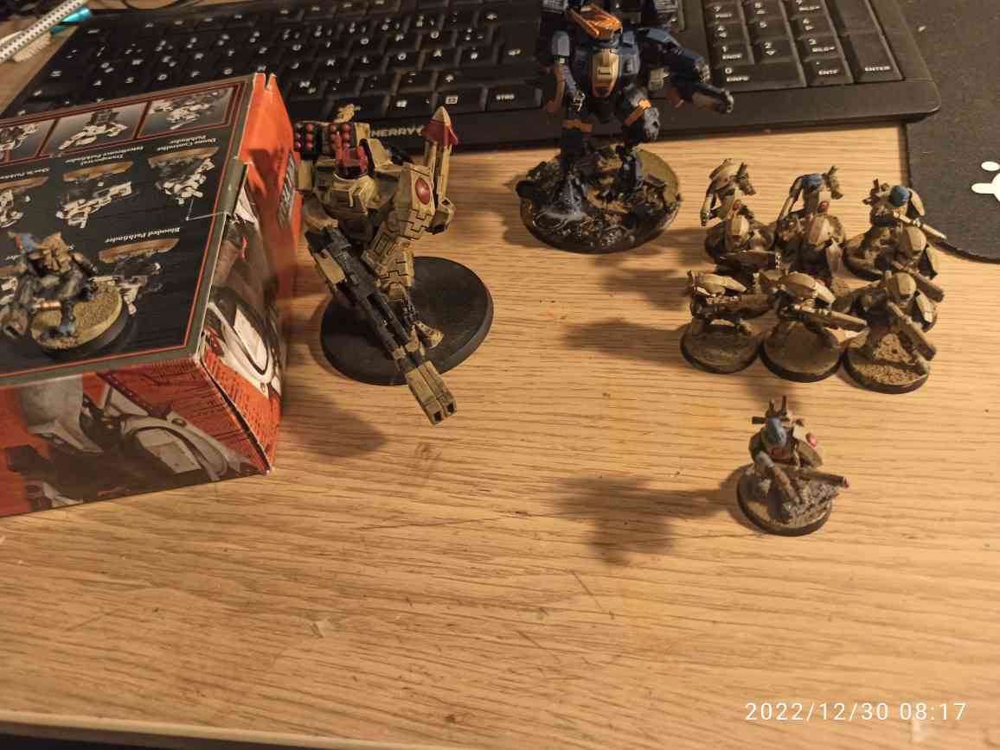

## Phase I: 500 Pkte

Download <a href="../assets/armylists/500/500_plops70.txt" download>500 Pkte army list</a> als .txt.

## Phase II: 750 Pkte

Download <a href="../assets/armylists/750/750_plops70.txt" download>750 Pkte army list</a> als .txt.  
Download <a href="../assets/armylists/750/750_plops70.rosz" download>750 Pkte army list</a> als .rosz.  